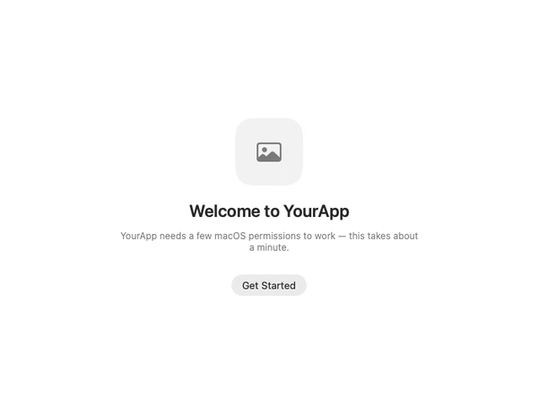
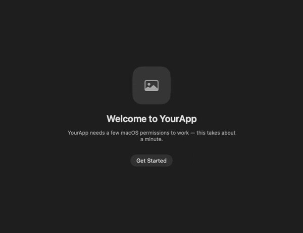
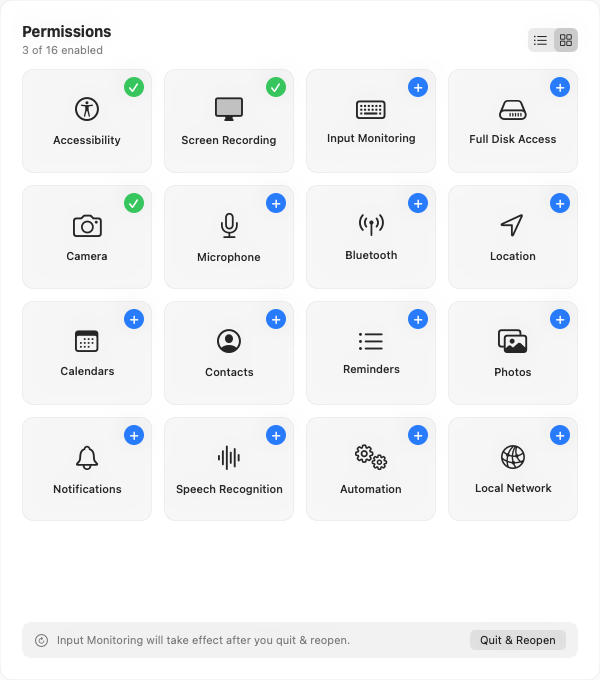

<p align="center">
  
</p>

# PermissionPilot

**Drop-in SwiftUI onboarding + permissions flow for non–App Store macOS apps.**
Detects, prompts, deep-links, and onboards across **16 macOS permissions** —
**zero dependencies**, Apple frameworks only.

[](https://github.com/arpitagarwal1301/PermissionPilot/actions/workflows/ci.yml)


Locally-distributed Mac apps (DMG / Homebrew) can't grant TCC permissions
programmatically — users flip toggles in System Settings, and every app re-invents
detection, prompting, deep-linking, and onboarding UI. PermissionPilot is that
layer, done once:

- 🧭 First-run **wizard** (welcome → permissions → done) with live re-check + auto-advance.
- ✅ Drop-in **rows / checklist / grid** that flip to ✓ and report "N of M enabled."
- 🔗 **Deep-links** to the exact Privacy pane; handles the macOS signing / relaunch / Sequoia gotchas.
- 🧩 **Composable** — engine only, components only, or the whole flow. No SDK branding: your app's name, icon, and accent.

<p align="center">
  
  
</p>
<p align="center"><sub>The first-run wizard — welcome → grant → done — in light and dark.</sub></p>

## Requirements

- macOS 12+, Swift 5.9+ / Xcode 15+
- Built for **non-sandboxed** apps. The engine + detection work under the App
  Sandbox too, but several permissions (Accessibility, Input Monitoring, Full Disk
  Access, Automation) don't — see **Sandbox compatibility** below.

<details>
<summary><b>Sandbox compatibility</b></summary>

PermissionPilot wraps only public Apple APIs, so its engine and **detection run
fine under the App Sandbox**. Whether a given *permission* is usable while
sandboxed is an Apple/entitlements matter, not a PermissionPilot one — it splits
in three:

- **Usable sandboxed** — add the matching App Sandbox entitlement + usage string:
  Camera, Microphone, Photos, Contacts, Calendars, Reminders, Location, Speech
  Recognition, Bluetooth, Notifications. Screen Recording works too (via
  ScreenCaptureKit), and the System Settings deep-links go through
  `NSWorkspace.open`, which the sandbox permits.
- **Not usable sandboxed** (Apple's position, not a library limit):
  **Accessibility** — `AXIsProcessTrusted()` still returns a value, but
  `AXUIElement` calls fail `.cannotComplete`; **Input Monitoring** — global event
  taps are restricted; **Full Disk Access** — the container blocks file access
  regardless, and the detection heuristic can't read its probe files (reports
  `.unknown`); **Automation** — needs scripting-target entitlements.

> A status call returning a value is **not** proof the capability works. If you're
> sandboxed, verify the real capability under your entitlements — an actual
> `AXUIElement` call, a live `CGEventTap`, a returned capture frame — not just the
> preflight check.
</details>

## Install

Swift Package Manager:

```swift
.package(url: "https://github.com/arpitagarwal1301/PermissionPilot.git", from: "0.1.0")
```

Depend on **`PermissionPilot`** for the full wizard (it re-exports the other two).
For finer-grained use: **`PermissionPilotUI`** (components) or **`PermissionPilotCore`**
(engine, no UI).

## Quick start

```swift
import PermissionPilot

let permissions = PermissionManager(
    required: [.accessibility, .screenRecording],
    optional: [.fullDiskAccess, .camera]
)

var config = OnboardingConfiguration(appName: "YourApp")
config.appIcon = Image("AppIcon")                  // optional; neutral placeholder otherwise
config.reasons = [.accessibility: "So YourApp can resize windows with your hotkey."]

if !PermissionPilot.hasCompletedOnboarding {
    PermissionPilot.presentOnboarding(manager: permissions, configuration: config)
}
```

`presentOnboarding` opens a real, titled `NSWindow` (no faked chrome). Prefer to
embed it? Use `OnboardingView` in your own window/sheet. `PermissionManager` is an
`@MainActor ObservableObject` that auto re-checks when the user returns from
System Settings, so SwiftUI views update on their own.

Tailor the flow via `OnboardingConfiguration`:

```swift
config.showsWelcomeStep = false   // skip the intro (you have your own onboarding)
config.showsDoneStep    = false   // finish straight back to your flow on Continue
config.colorScheme      = .dark   // pin light/dark; nil (default) follows the system
config.tint             = .indigo // accent; icon and per-permission reasons too
```

> Already have your own onboarding and just want the live permission UI? Skip the
> wizard entirely and drop `PermissionsView(manager:)` / `PermissionChecklist(manager:)`
> straight into your views.

<details>
<summary><b>Components &amp; engine only</b></summary>

```swift
// Components — drop into your own onboarding UI:
PermissionChecklist(manager: permissions)                       // card + counter + live rows
PermissionsView(manager: permissions)                           // adds a List ⇄ Grid toggle
JustInTimePermissionButton(manager: permissions, permission: .camera)

// Engine — no UI:
permissions.refresh()                                           // re-detect now
permissions.request(.screenRecording)                           // prompt or deep-link
permissions.status(for: .screenRecording)                       // .granted / .denied / …
permissions.allRequiredGranted
```

Theme with `OnboardingConfiguration(appName:tint:)` or `.permissionPilotTint(_:)`
on any subtree. Colors are system-semantic (adapt to dark mode / contrast /
accent); green means granted only, and status is never conveyed by color alone
(VoiceOver reads it out).
</details>

## ⚠️ The two things that will bite you

**1 — Info.plist usage strings.** A prompt-based permission **crashes the app on
first request** without its usage-description key (PermissionPilot asserts and
fails gracefully instead of crashing, but the permission won't work until you add
it). Add the keys you use: `NSCameraUsageDescription`, `NSMicrophoneUsageDescription`,
`NSContactsUsageDescription`, `NSPhotoLibraryUsageDescription`,
`NSLocationWhenInUseUsageDescription`, `NSSpeechRecognitionUsageDescription`,
`NSBluetoothAlwaysUsageDescription`. **Calendars/Reminders need both** the macOS
14+ `…FullAccessUsageDescription` and the 12–13 legacy key. (Notifications,
Accessibility, Screen Recording, Input Monitoring need none.)

**2 — Code-signing & TCC persistence.** macOS ties every grant to your **code
signature + bundle ID**. Ad-hoc / unsigned / changing signatures look like a "new
app" on each rebuild and **drop all grants**. Sign with a **stable identity**
(Apple Development in dev; **Developer ID + notarization** for distribution) and
keep the bundle ID constant. Recover a stuck state with
`tccutil reset <Service> <bundle-id>`. On **MDM-managed Macs**, corporate PPPC
policy can silently suppress prompts for non-notarized apps. PermissionPilot
surfaces these states clearly but **cannot fix signing** — that's your build setup.

<p align="center">
  <picture>
    <source media="(prefers-color-scheme: dark)" srcset="docs/board-grid-dark.png">
    
  </picture>
</p>
<p align="center"><sub>All 16 permissions — List ⇄ Grid, live status. Adapts to your theme.</sub></p>

<details>
<summary><b>Per-permission reference</b> — detection · prompt · Settings anchor · Info.plist key</summary>

| Permission | Detection | In-app prompt? | Settings anchor | Info.plist key |
|---|---|---|---|---|
| Accessibility | `AXIsProcessTrusted` | system prompt → Settings | `Privacy_Accessibility` | — |
| Screen Recording | `CGPreflightScreenCaptureAccess` | `CGRequestScreenCaptureAccess` | `Privacy_ScreenCapture` | — |
| Input Monitoring | `IOHIDCheckAccess(.listenEvent)` | `IOHIDRequestAccess` | `Privacy_ListenEvent` | — |
| Camera | `AVCaptureDevice.authorizationStatus(.video)` | `requestAccess(.video)` | `Privacy_Camera` | **`NSCameraUsageDescription`** |
| Microphone | `AVCaptureDevice.authorizationStatus(.audio)` | `requestAccess(.audio)` | `Privacy_Microphone` | **`NSMicrophoneUsageDescription`** |
| Location | `CLLocationManager.authorizationStatus` | `requestWhenInUseAuthorization` | `Privacy_LocationServices` | **`NSLocationWhenInUseUsageDescription`** |
| Contacts | `CNContactStore.authorizationStatus(.contacts)` | `requestAccess(.contacts)` | `Privacy_Contacts` | **`NSContactsUsageDescription`** |
| Calendars | `EKEventStore.authorizationStatus(.event)` | `requestFullAccessToEvents`¹ | `Privacy_Calendars` | **`NSCalendarsFullAccessUsageDescription`**¹ |
| Reminders | `EKEventStore.authorizationStatus(.reminder)` | `requestFullAccessToReminders`¹ | `Privacy_Reminders` | **`NSRemindersFullAccessUsageDescription`**¹ |
| Photos | `PHPhotoLibrary.authorizationStatus(.readWrite)` | `requestAuthorization(.readWrite)` | `Privacy_Photos` | **`NSPhotoLibraryUsageDescription`** |
| Speech Recognition | `SFSpeechRecognizer.authorizationStatus` | `requestAuthorization` | `Privacy_SpeechRecognition` | **`NSSpeechRecognitionUsageDescription`** |
| Bluetooth | `CBManager.authorization` | instantiate `CBCentralManager` | `Privacy_Bluetooth` | **`NSBluetoothAlwaysUsageDescription`** |
| Notifications | `getNotificationSettings` (async) | `requestAuthorization` | — | — |
| Full Disk Access | heuristic read of a TCC-protected path | none — deep-link only | `Privacy_AllFiles` | — |
| Automation | none — per-target Apple Events | none — deep-link only | `Privacy_Automation` | — |
| Local Network | none — no status API (macOS 15+) | none — deep-link only | `Privacy_LocalNetwork` | — |

¹ macOS 14+ uses `requestFullAccessTo…` + the `…FullAccessUsageDescription` keys;
12–13 use `requestAccess(to:)` + legacy `NSCalendarsUsageDescription` /
`NSRemindersUsageDescription`. PermissionPilot picks the right API/key per OS.

Notes: **Notifications** status is async-only (served from a cache, auto-refreshed).
**Input Monitoring** and pre-Sequoia **Screen Recording** only apply after a quit &
reopen — the wizard surfaces a **Quit & Reopen** button (`manager.quitAndReopen()`).
**Automation / Local Network / Full Disk Access** are deep-link-only (no honest
in-app prompt), so their rows always open System Settings.
</details>

## Try the demo

The full wizard plus a live status window showing all 16 permissions (List ⇄
Grid) — no build required, good for evaluating the flow before you integrate.
Both downloads are universal (Apple Silicon + Intel). Neither is notarized (this
repo ships no paid Developer ID), so each needs a **one-time, GUI-only** approval.

### Recommended — installer (`.pkg`)

Download **[PermissionPilot-Demo.pkg](https://github.com/arpitagarwal1301/PermissionPilot/releases/latest/download/PermissionPilot-Demo.pkg)** and double-click it.

macOS asks you to approve the unidentified installer **once** — **right-click the
`.pkg` → Open**, or **System Settings → Privacy & Security → Open Anyway**. No
Terminal. After it installs, `PermissionPilot Demo` is in `/Applications` and
**opens cleanly** — pkg-installed files aren't quarantined, so there's no
per-launch prompt.

### Alternative — disk image (`.dmg`)

Download **[PermissionPilot-Demo.dmg](https://github.com/arpitagarwal1301/PermissionPilot/releases/latest/download/PermissionPilot-Demo.dmg)**, drag the app to Applications, then on first launch (the app itself is quarantined here):

- **Right-click** the app → **Open** → **Open**, or
- `xattr -dr com.apple.quarantine "/Applications/PermissionPilot Demo.app"`

> For your *own* app, sign with a stable identity (Developer ID + notarization for
> distribution) — see the code-signing note above. The demo is ad-hoc signed only
> because this repo ships no paid Developer ID.

### Build it yourself

```bash
Example/build-demo-app.sh --open
```

Builds, signs (with your local identity), and launches the demo as its own `.app`.
**Don't** test permissions with `swift run PermissionPilotDemo`: an unbundled,
unsigned binary is attributed to the **responsible parent process** (your
terminal), so System Settings shows the wrong app and toggles never stick.

## License & credits

[MIT](LICENSE). No third-party code — detection, deep-links, the wizard, and
drag-to-authorize are original. The Full Disk Access check uses the
TCC-protected-file probe technique, as also used by the MIT-licensed
[FullDiskAccess](https://github.com/inket/FullDiskAccess).
