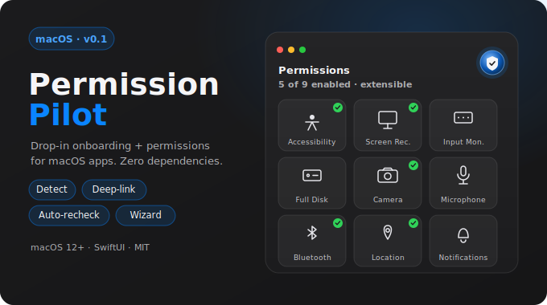
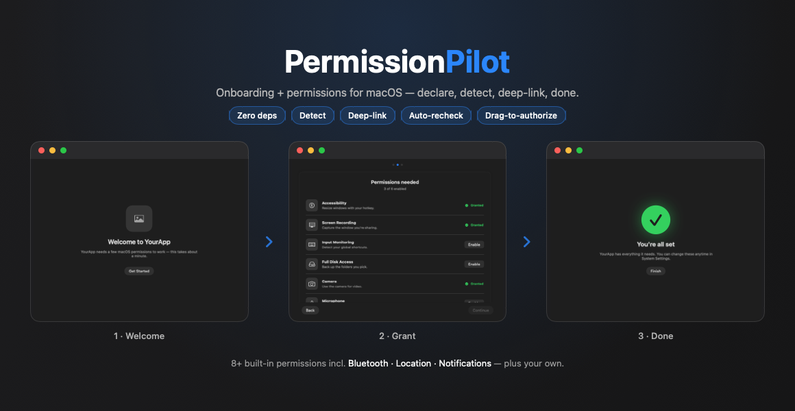

<p align="center">
  
</p>

# PermissionPilot

**Drop-in SwiftUI onboarding + permissions flow for macOS apps** — Accessibility,
Screen Recording, Input Monitoring, Full Disk Access, Camera, Microphone.
**Zero dependencies.**


Locally-distributed macOS apps (DMG / Homebrew, **not** the Mac App Store) can't
grant system permissions programmatically — the user has to flip toggles in
System Settings. Every such app re-invents detection, prompting, deep-linking,
and onboarding UI. PermissionPilot is that layer, done once, properly:

- 🧭 A polished first-run **wizard** (welcome → permissions → done) with a step indicator.
- ✅ A live **checklist** that flips rows to ✓ and reports "N of M enabled".
- 🔁 **Auto re-check + auto-advance** when the user returns from System Settings.
- 🔗 **Deep-links** to the exact Privacy & Security pane, with fallbacks.
- 🧩 **Composable**: use the engine, the components, or the whole flow.
- 🧱 Built-in handling of the well-known macOS gotchas (signing/TCC, relaunch, Sequoia re-prompts).
- 🚫 **No third-party dependencies** — Apple frameworks only.

> The SDK ships **no branding of its own** — every string, icon, and the accent
> color come from your app, each with a sensible default.

<p align="center">
  
</p>

<p align="center"><sub>The first-run wizard: welcome → grant (live checklist + deep-links) → done.</sub></p>

---

## Requirements

- macOS 12+
- Swift 5.9+ / Xcode 15+
- A **non-sandboxed** app (these permissions and deep-links are disallowed under the App Sandbox / Mac App Store).

## Installation

Swift Package Manager. In Xcode: **File ▸ Add Package Dependencies…** and enter the
repo URL, or add it to your `Package.swift`:

```swift
dependencies: [
    .package(url: "https://github.com/arpitagarwal1301/PermissionPilot.git", from: "0.1.0")
],
targets: [
    .target(name: "MyApp", dependencies: [
        .product(name: "PermissionPilot", package: "PermissionPilot")
    ])
]
```

Three products, each usable on its own:

| Product | Contains | Use when |
|---|---|---|
| `PermissionPilotCore` | model + `PermissionManager` engine, no UI | you only want detection/logic |
| `PermissionPilotUI` | `PermissionRow`, `PermissionChecklist`, `JustInTimePermissionButton` | you have your own onboarding |
| `PermissionPilot` | the full wizard (re-exports Core + UI) | you want the whole experience |

`import PermissionPilot` re-exports the other two, so one import is enough.

---

## Quick start — the full wizard

```swift
import PermissionPilot

let permissions = PermissionManager(
    required: [.accessibility, .screenRecording, .inputMonitoring],
    optional: [.fullDiskAccess]
)

var config = OnboardingConfiguration(appName: "YourApp")
config.appIcon = Image("AppIcon")          // optional; neutral placeholder otherwise
config.reasons = [                          // host-overridable one-line "why"
    .accessibility:   "So YourApp can resize windows with your hotkey.",
    .screenRecording: "So YourApp can capture the window you're sharing.",
]

PermissionPilot.presentOnboarding(manager: permissions, configuration: config) {
    print("Onboarding finished — completion persisted")
}
```

Show it once on first run and let users re-open it later:

```swift
if !PermissionPilot.hasCompletedOnboarding {
    PermissionPilot.presentOnboarding(manager: permissions, configuration: config)
}
// later, from a Settings item:
PermissionPilot.resetOnboarding()   // or just call presentOnboarding again
```

`presentOnboarding` opens a real, titled `NSWindow` (genuine traffic-light
chrome — nothing is faked). Prefer to embed it yourself? Use `OnboardingView`
directly in any window or sheet.

## Components only

```swift
import PermissionPilotUI

struct SetupView: View {
    @StateObject var permissions = PermissionManager(required: [.accessibility, .camera])
    var body: some View {
        PermissionChecklist(manager: permissions)   // card + "N of M enabled" + live rows
    }
}
```

Just-in-time, at the point of use:

```swift
JustInTimePermissionButton(manager: permissions, permission: .camera)
```

## Engine only

```swift
import PermissionPilotCore

let permissions = PermissionManager(required: [.screenRecording])
permissions.refresh()                                  // re-detect now
permissions.request(.screenRecording)                  // prompt or deep-link
if permissions.allRequiredGranted { /* … */ }
let status = permissions.status(for: .screenRecording) // .granted / .denied / …
```

`PermissionManager` is an `@MainActor ObservableObject`. It re-checks on
`NSApplication.didBecomeActiveNotification` plus a light fallback poll, so your
SwiftUI views update automatically when the user returns from System Settings.

### Theming

```swift
OnboardingConfiguration(appName: "YourApp", tint: .indigo)   // accent override
// or on any component subtree:
PermissionChecklist(manager: permissions).permissionPilotTint(.indigo)
```

Colors are **system semantic** colors, so the UI adapts to dark mode,
increase-contrast, and the user's accent automatically. Green is reserved for the
granted state only; status is never conveyed by color alone (VoiceOver reads it out).

---

## Per-permission reference

| Permission | Detection | In-app prompt? | Settings anchor | Info.plist key |
|---|---|---|---|---|
| Accessibility | `AXIsProcessTrusted` | system prompt → Settings | `Privacy_Accessibility` | `NSAccessibilityUsageDescription` (optional) |
| Screen Recording | `CGPreflightScreenCaptureAccess` | `CGRequestScreenCaptureAccess` | `Privacy_ScreenCapture` | — |
| Input Monitoring | `IOHIDCheckAccess(.listenEvent)` | `IOHIDRequestAccess` | `Privacy_ListenEvent` | — |
| Camera | `AVCaptureDevice.authorizationStatus(.video)` | `requestAccess(.video)` | `Privacy_Camera` | **`NSCameraUsageDescription`** |
| Microphone | `AVCaptureDevice.authorizationStatus(.audio)` | `requestAccess(.audio)` | `Privacy_Microphone` | **`NSMicrophoneUsageDescription`** |
| Full Disk Access | heuristic read of a TCC-protected path | none — deep-link only | `Privacy_AllFiles` | — |

### Info.plist usage strings (required for Camera/Microphone)

Camera and Microphone **crash the app on first access** without their usage
strings. Add them to your app target's Info.plist:

```xml
<key>NSCameraUsageDescription</key>
<string>YourApp uses the camera for video features.</string>
<key>NSMicrophoneUsageDescription</key>
<string>YourApp uses the microphone for audio features.</string>
```

---

## ⚠️ Code-signing & TCC persistence (read this)

This is the single most common reason "permissions keep resetting." macOS ties a
TCC grant to your app's **code signature + bundle identifier**. If either changes,
the grant is lost.

- **Ad-hoc / unsigned / changing signatures** → the system sees a "new" app on
  every rebuild and **drops every grant**. You'll re-authorize forever.
- **Fix:** sign with a **stable identity** — an Apple Development identity in dev,
  a **Developer ID** identity for distribution — and keep the **bundle ID and
  install path constant**.
- **Recover a stuck state:** `tccutil reset <Service> <bundle-id>`
  (e.g. `tccutil reset ScreenCapture com.yourcompany.yourapp`).
- **Distribution:** these apps are non-sandboxed; for smooth local distribution,
  **Developer ID + notarization** is effectively required (otherwise Gatekeeper
  friction and flaky TCC).

PermissionPilot surfaces these states clearly — but it **cannot fix signing**.
That's on your build setup.

## Other gotchas (handled in the flow)

- **Relaunch to take effect** — Input Monitoring (and pre-Sequoia Screen
  Recording) only apply after quit & reopen. The wizard shows a **Quit & Reopen**
  affordance (`manager.quitAndReopen()`).
- **Sequoia recurring Screen Recording prompt** — macOS re-asks periodically;
  there's no entitlement to suppress it. The wizard pre-warns in copy
  (`OnboardingConfiguration.showsScreenRecordingPrewarning`).
- **Stale `CGPreflight` snapshot** — detection is always queried fresh, never
  cached, so a mid-session change isn't masked.
- **Full Disk Access has no API** — detection is a heuristic read of a
  TCC-protected file; there's no prompt, only the deep-link.

---

## Example app

A runnable demo lives in [`Example/PermissionPilotDemo`](Example/PermissionPilotDemo)
— the full wizard with four permissions plus a live status window and "re-run
onboarding" controls.

**To actually test permission toggling, run it as a signed `.app` bundle:**

```bash
Example/build-demo-app.sh --open
```

This builds, bundles, signs, and launches **PermissionPilot Demo** as its own
app — so it appears under that name in System Settings and permission toggles
take effect (Accessibility live; Input Monitoring after the built-in Quit &
Reopen). The script uses your Apple Development / Developer ID identity if you
have one (grants then persist across rebuilds), otherwise ad-hoc signs.

> **Don't test permissions with `swift run PermissionPilotDemo`.** That produces
> an *unbundled, unsigned* binary, so macOS attributes its permission requests
> to the **responsible parent process** (your terminal) — System Settings shows
> the wrong app and toggles never reflect back to the demo. `swift run` is fine
> for a quick look at the UI, nothing more. (This is the same code-signing/TCC
> rule described above — it applies to *your* app too.)

---

## Credits

PermissionPilot imports **no third-party code** and is implemented independently
on Apple frameworks — detection, deep-links, the onboarding wizard, and
drag-to-authorize are all original.

The Full Disk Access check uses the well-known technique of probing a
TCC-protected file, as also used by the MIT-licensed
[FullDiskAccess](https://github.com/inket/FullDiskAccess).

## License

[MIT](LICENSE).
